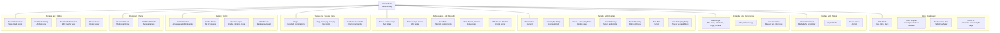

# Feature Map (Visual)

Open this file on GitHub or in any Markdown viewer that supports Mermaid to see the diagram rendered.

```mermaid
flowchart TB
    A["Aakash Astro\nFeature Map"]

    subgraph Core_Dashboard
        C1["Birth details\nDate, time, place"]
        C2["Chart engines\nSwiss Ephemeris or fallback"]
        C3["South Indian chart\nVedicChartView"]
        C4["Planet list\nNakshatra and strength flags"]
    end

    subgraph Dashas_and_Timing
        D1["Vimshottari Dasha\nMahadasha and Antar"]
        D2["Yogini Dasha"]
        D3["Chara Dasha\nJaimini"]
    end

    subgraph Calendar_and_Panchanga
        P1["Panchanga\nTithi, Vara, Nakshatra, Yoga, Karana"]
        P2["Today's Panchanga"]
        P3["Tara Calculator\nManual tara reference"]
    end

    subgraph Transits_and_Overlays
        T1["Transit Chart\nCurrent"]
        T2["Transit (Any Date)\nUser-selected"]
        T3["Transit + Tara (Any Date)\nCombo view"]
        T4["Transit Overlay\nSaturn and Jupiter"]
        T5["Transit Overlay\nRahu and Ketu"]
        T6["Tara Bala\nCurrent"]
        T7["Tara Bala (Any Date)\nTransit vs natal Moon"]
    end

    subgraph Ashtakavarga_and_Strength
        A1["Sarva Ashtakavarga\nSAV totals"]
        A2["Ashtakavarga Details\nBAV tables"]
        A3["Shadbala\nStrength components"]
        A4["Ishta, Kashta, Harsha\nBala scores"]
        A5["64th D9 and 22nd D3\nCritical points"]
    end

    subgraph Yogas_and_Special_Views
        Y1["Yogas\nDetected combinations"]
        Y2["Yogi, Sahayogi, Avayogi\nYogi point"]
        Y3["Pushkara Navamsha\nElemental bands"]
    end

    subgraph Jaimini_Toolkit
        J1["Jaimini Karakas\nAtmakaraka to Darakaraka"]
        J2["Arudha Padas\nAll 12 houses"]
        J3["Special Lagnas\nArudha, Ghatika, Hora"]
        J4["Ishta Devata\nKarakamsa-based"]
    end

    subgraph Divisional_Charts
        V1["Divisional Charts\nShodasha Vargas"]
        V2["D60 Shashtiamsha\nAmsha ranges"]
    end

    subgraph Storage_and_Utilities
        U1["Saved Horoscopes\nSave, load, delete"]
        U2["Kundali Matching\nAshta-koota"]
        U3["Sarvatobhadra Chakra\nSBC overlay view"]
        U4["Privacy Policy\nIn-app viewer"]
    end

    A --> C1
    A --> D1
    A --> P1
    A --> T1
    A --> A1
    A --> Y1
    A --> J1
    A --> V1
    A --> U1
```
